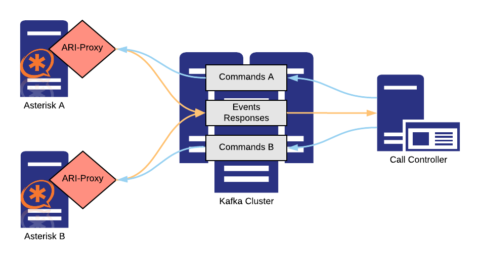

The [retel.io project](http://retel.io) develops concepts and software componentens for building carrier grade, distributed and resilient telephony services scaling up to millions of active users.

The scalability concept of retel.io is based on the decoupling of signalling and media-management using Apache Kafka as a message broker. Service logic implementation, further referenced as "call-controller", and asterisk instances may therefore be scaled and deployed independently. As ari-proxy takes care of mapping ARI communication to the appropriate resources, there is a one-to-one mapping of asterisk Stasis app and ari-proxy (see [service partitioning](#service-partitioning) for more details).



# message processing
This section describes in detail, how ari-proxy handles different types of messages that are exchanged in a retel.io call-application setup:

## events
The term *events* is used for messages, that are generated by Asterisk, provided via [asterisk's ARI](https://wiki.asterisk.org/wiki/display/AST/Getting+Started+with+ARI) and describe actual events on asterisk resources. Events are consumed by ari-proxy via websocket. The provided JSON structure of an ARI-event is further encapsulated in an envelope structure to allow for transportation of additional meta-data. To map messages to the appropriate resources, ari-proxy uses an identifier called "callcontext" that is derived from asterisk channel information. All ari-proxy instances in a retel.io-setup publish events to the same *events-and-responses topic*. As Kafka dispatches messages to consumers based on the *routing key*, it ensures that all messages of a callcontext are processed by the same consumer (this again is a simplification; see [resilience](#resilience) for further details), ensuring the critical ordering of messages.

Example of an encapsulated ARI event (see `payload` field) as it is published to Kafka on the *events-and-responses topic*:
```json
{
   "type": "STASIS_START",
   "commandsTopic": "ari-callcontroller-demo-commands-000000000002",
   "payload": {
     "type": "StasisStart",
     "timestamp": "2018-08-27T16:19:36.049+0200",
     "args": [],
     "channel": {
       "id": "1535379576.296",
       "name": "PJSIP/proxy-0000009a",
       "state": "Ring",
       "caller": {
         "name": "",
         "number": "555-1234567"
       },
       "connected": {
         "name": "",
         "number": ""
       },
       "accountcode": "",
       "dialplan": {
         "context": "default",
         "exten": "10000",
         "priority": 3
       },
       "creationtime": "2018-08-27T16:19:36.040+0200",
       "language": "en",
       "channelvars": {}
     },
     "asterisk_id": "00:00:00:00:00:02",
     "application": "callcontroller-demo"
   },
   "resourceId": "1535379576.296",
   "commandId": "23"
}

```

## commands
The term *commands* refers to operations requested by a call-controller instance to a specific asterisk instance and resource. Every ari-proxy is provided with a unique *commands topic* to which it subscribes. The envelope-structure that encapsulates each event contains the appropriate *commands topic* which can be used by the consuming call-controller to publish its commands to the appropriate Kafka topic. Besides the instance specific *commands topic* which allows the call-controller to react to events, all ari-proxy instances subscribe to a generic commands topic (**Not yet implemented!**). Messages to this generic command topic are distributes round-robin by Kafka, allowing a call-controller instance to initiate a session (e.g. starting a new call). Similar to events, commands are encapsulated in an envelope structure:

```json
{
   "ariCommand" : {
      "method" : "DELETE",
      "url" : "/ari/channels/1538054167.95404"
   },
   "resourceId" : "1538054167.95404"
}
```

When processing a command that creates a new resource in asterisk, ari-proxy registers the unique identifier (e.g. *RecordingName* or *PlaybackId*) provided with the command, mapping it to the related call-context. This allows events that will be generated by those resources to be mapped to the originating call-context.

## responses
*responses* carry the ARI response to a command. ari-proxy encapsulates the HTTP response to the commands' HTTP request and publishes it on the *events-and-responses topic*. Based on the mapping of command message to callcontext, ari-proxy determines the call-context for a response message to ensure proper routing to the sending call-controller instance.

Example of an encapsulated ARI response as it is published to Kafka on the *events-and-responses topic*:
```json
{
   "payload" : {
      "status_code":204
   },
   "commandsTopic" : "ari-callcontroller-demo-commands-000000000002",
   "resourceId" : "1538042428.94989",
   "type" : "RESPONSE"
}
```

# beyond simplification
## service partitioning
A single asterisk instance may spawn multiple Stasis applications. This may be used for a modular service setup or to share asterisk resources between completely independent services. Ari-proxy supports this type of partitioning. Multiple ari-proxy instances may be dedicated to a single asterisk instance, by dispatching channels to different Stasis applications.

## resilience
While the use of the call-context as the Kafka *routing key* ensures ordering of message-processing this concept also allows for automatic reallocation of a callcontext to a responsible call-controller. When a call-controller instance crashes or is intentionally shut down, Kafka's built-in reallocation of *routing key* to consumer ensures that a different instance will take over the handling of the running session. This implies that potential state information is persisted and shared between call-controller instances.
